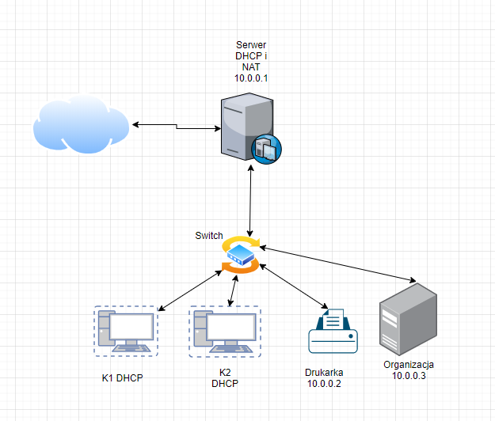

### Dokumentacja konfiguracji sieci biurowej z użyciem VirtualBox

Struktura Projektu:



Struktura VirtualBoxB:
| Server DHCP |
| DRUKARKA    |
| KLIENT01   |
| KLIENT02    |
| ORG-KLNT    |


Serwer  z DHCP jest skonfigurowany na  dwie karty sieciowe 
| NAT | sieć NAT ‘Lan’ |

Reszta urządzeń jest podłączonych do sieci NAT ‘Lan’

###### Konfiguracja DHCP

We włączonej maszynie DHCP-SERVER wpisuję ```vi /etc/network/interfaces```
Serwer musi posiadać statyczny adres ip toteż na końcu pliku dodaję:
```
auto eth1
iface eth1 inet static 
      address 10.10.0.1
      netmask 255.255.255.0
```


taki sam będzie wynik komendy ``` cat /etc/network/interfaces ```


Restartuje interfejsy za komendą ```service networking restart```,sprawdzam czy zaszły zmiany - ```ip a```.
Instaluję serwer DHCP - na urządzeniu używam komendy ```apk add dhcp```

Zmiany wprowadzone w ```/etc/dhcp/dhcpd.conf``` :


Wpisuję ```service dhcpd restart```

Sprawdzam czy KLIENT1 otrzymał dns oraz adres ip:


Adres klienta ```ORG-KLNT```.


######  Konfiguracja NAT
 ```Server DHCP```
 
 Wpisuję ``` vi /etc/sysctl.conf``` i dodaję linie ```net.ipv4.ip_forward=1```.
 
 Następnie instaluję paczkę iptables - ```apk add iptables``` i wpisuję - ```iptables -t nat -A POSTROUTING -o eth0 -j MASQUERADE```, to umożliwi zmianę adresu IP prywatnego na publiczny.
 
 Teraz z dowolnego clienta mogę zapignować hosta z zewnątrz np. google.pl
 
######  Konfiguracja DNS
Na maszynie  ```Server DHCP```  dodaję komende ```apk add dnsmasq```

Do pliku ```/etc/hosts``` dodaje:


Chcę zobaczyć zmiany w pliku ```/etc/hosts/``` restartuje dns komedną: ```service dnsmasq restart```

Wynik użycia komendy ```nslookup``` z maszyny ``` KLIENT01```.


 


